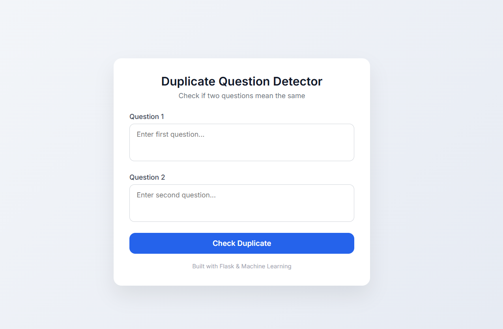
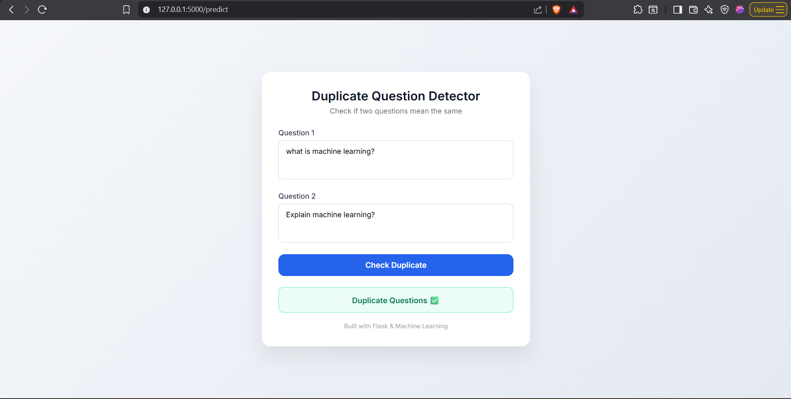
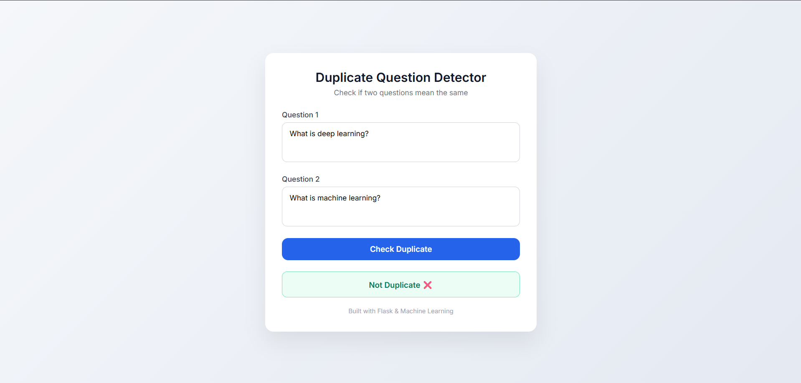

# Duplicate Question Detector 🧠✨

A Machine Learning–powered web application that detects whether two questions are **duplicates (semantically similar)** or **not**, inspired by the Quora Question Pairs problem.

The project combines **NLP feature engineering**, **Machine Learning**, and a **Flask-based web interface** with a clean Adobe-style UI.

---

### 🔹 Home Page


### 🔹 Prediction Result


## 🚀 Features

- 🔍 Detects if two questions mean the same
- 🧠 Machine Learning model trained on text features
- ✍️ Uses Bag of Words (BoW) + Fuzzy Matching
- ⚡ Rule-based shortcut for exact duplicate questions
- 🎨 Clean, modern, Adobe-inspired UI
- 🌐 Flask web application
- 🐳 Docker support for easy deployment

---

## 🛠️ Tech Stack

### Backend
- Python
- Flask
- Scikit-learn
- NLTK
- FuzzyWuzzy
- NumPy, Pandas

### Frontend
- HTML5
- CSS3 (Adobe-style UI)
- Jinja2 Templates

### DevOps
- Docker

---

## 📂 Project Structure
```duplicate-question-detector/
│
├── app.py                # Flask application
├── model.pkl             # Trained ML model
├── cv.pkl                # CountVectorizer
├── requirements.txt      # Python dependencies
├── Dockerfile            # Docker configuration
│
├── templates/
│   └── index.html        # Frontend UI
│
├── train.csv             # Training data
├── test.csv              # Test data
└── README.md             # Project documentation```


## ⚙️ How It Works

1. User enters two questions
2. Questions are preprocessed (lowercase, cleaned text)
3. Features extracted:
   - Bag of Words (BoW)
   - Fuzzy similarity scores
4. Feature size is aligned with trained model
5. ML model predicts:
   - **Duplicate Questions ✅**
   - **Not Duplicate ❌**

⚠️ Exact same questions are directly marked as duplicate using a rule-based check.

---
